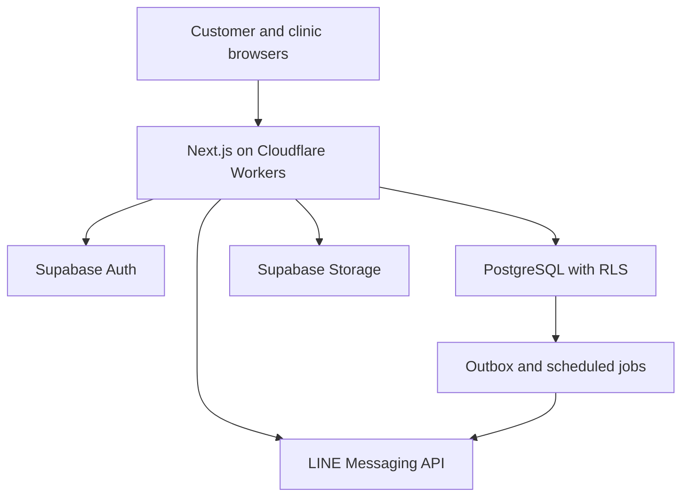

# Architecture

## System shape



## Selected components

- Frontend/server: Next.js App Router, TypeScript strict, React Server Components where useful, server actions/routes for trusted mutations.
- Styling: Tailwind CSS with shared design tokens.
- Database: Supabase PostgreSQL with migrations, constraints, indexes, RLS, and transactional SQL functions.
- Identity: Supabase Auth plus application profiles and tenant memberships.
- Files: Supabase Storage with tenant-scoped paths and policies.
- Hosting: Cloudflare Workers using OpenNext and Wrangler.
- Messaging: LINE Messaging API behind a server-only adapter.
- Jobs: scheduled invocation plus PostgreSQL outbox; every consumer is idempotent.

## Recommended repository layout

```text
src/
  app/
    (public)/
    admin/
    platform/
    api/
  components/
  domain/
  features/
  data/
  integrations/
  lib/
supabase/
  migrations/
  seed.sql
  tests/
tests/
docs/
```

## Trust boundaries

- Browser input is untrusted.
- The anonymous Supabase key is public by design but grants only RLS-authorized operations.
- Prefer server endpoints for public writes and privileged operations.
- The service-role key is server-only and used narrowly; service-role usage must still apply application authorization because it bypasses RLS.
- LINE webhooks verify signatures before parsing or writing.
- Uploaded files are validated before storage and served with authorization or short-lived signed URLs.

## Concurrency design

- Booking request creation calls a transactional database function.
- Functions lock capacity/room rows in deterministic order.
- Planned allocation overlap is protected by constraints/indexes plus transaction logic.
- Check-in locks the booking and room and creates one open stay under a partial unique constraint.
- Checkout locks the booking/open stay/room, closes stay, writes charges/snapshots, and changes operational state.
- Idempotency keys protect retried public submissions, payment verification, LINE webhooks, expiry, and checkout.

## Performance design

Legacy screens waited about ten seconds because each navigation could cause multiple sequential GAS calls and full-sheet scans. The new design must:

- index tenant/status/date/room foreign keys;
- fetch view-specific projections, not whole tables;
- combine related dashboard data into one server query/RPC where appropriate;
- paginate long booking and audit lists;
- cache stable settings and room inventory with safe invalidation;
- avoid client waterfalls and use route-level loading states;
- measure slow queries with `EXPLAIN ANALYZE` during development.

## Integration boundaries

- `NotificationProvider`: LINE now, additional channels later.
- `PaymentEvidenceProvider`: upload/verification facts now, POS/payment gateway later.
- `ReceiptRenderer`: HTML/80 mm browser print now, PDF/thermal bridge later.
- `AuditSink`: PostgreSQL append-only now; export/SIEM later.
- Future POS, attendance, and medical modules consume shared tenant/customer/pet identifiers through explicit service interfaces or events, not direct cross-feature table edits.

## Environment and deployment

- Separate local, staging, and production Supabase projects/schemas.
- Apply migrations in CI before application promotion with a documented rollback/forward-fix plan.
- Configure Cloudflare secrets outside source control.
- Use preview deployments against non-production data.
- Health checks must verify application availability without exposing secrets or customer records.
